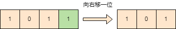
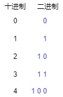
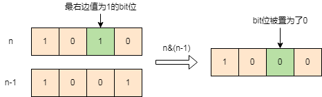

> *题目链接：* https://leetcode.cn/problems/counting-bits/

# LeetCode 338. 比特位计数

## 题目描述

给你一个整数 `n` ，对于 `0 <= i <= n` 中的每个 `i` ，计算其二进制表示中 `1` 的个数 ，返回一个长度为 `n + 1` 的数组 `ans` 作为答案。

**举个例子：**

```
输入：n = 2
输出：[0,1,1]
解释：
0 --> 0
1 --> 1
2 --> 10
```

## 知识回顾

**动态规划**是一种通过将原问题分解为子问题来求解复杂问题的算法思想。它通常用于**求解最优化问题**，例如最长公共子序列、背包问题等。动态规划的核心思想是将原问题分解为若干个子问题，通过求解子问题的最优解**自下而上**推导出原问题的最优解。

## 思路解析

如果对区间`[0, n]`上的数逐个求对应二进制中`1`的个数是比较耗时的，下面来介绍使用动态规划来解此题。动态规划的关键是**推导状态转移公式**和**边界条件处理**。

下面介绍这道题目两种不同状态转移公式。

### 方法一

首先复习一下二进制的基本操作，如何**获取`n`对应二进制的最右边一位**和怎样**将`n`对应的二进制向右移一位**。

**获取n对应二进制最右面一位有两种方式：**
1. `n`和`1`进行与运算`n & 1`可以获取`n`对应二进制的最右面一位。
2. `n`对`2`取余`n % 2`即可获取`n`对应二进制的最右面一位。


**将`n`对应的二进制右移一位有两种方式：**
1. 直接使用编程语言自带的右移符号，比如`c++`可以写为`n >> 1`。
2. `n / 2` 也可以将`n`对应的二进制右移一位。



进入正题，定义`dp[i]`为`i`的二进制中`1`的个数, 观察整数区间`[0,4]`对应的二进制。



把`4`对应的二进制向右移动一位，就变成了`2`对应的二进制，`4`和`2`的二进制中的`1`是相同的。

```
dp[4] = dp[2]
```

把`3`对应的二进制向右移动一位，就变成了`1`对应的二进制，`3`的二进制比`1`的二进制中`1`的个数多`1`。

```
dp[3] = dp[1] + 1
```

总结上面的规律，得到**状态转移公式**如下：

如果整数`i`为偶数，也就是`i`的二进制最右面的`bit位`为`0`，这个时候右移，二进制中的`1`并没有损失，`dp[i] = dp[i/2]`。

如果整数`i`为奇数，也就是`i`的二进制最右面的`bit位`为`1`，这个时候右移，二进制中的`1`会减少一个，`dp[i] = dp[i/2] + 1`。

**边界条件为：** `dp[0] = 0`。

### C++代码

```cpp
class Solution {
public:
    vector<int> countBits(int n) {
        vector<int> dp(n+1, 0);
        for (int i = 1; i <=n; ++i) {
            if (i % 2 == 0) {
                //i为偶数
                dp[i] = dp[i/2];
            } else {
                //i为奇数
                dp[i] = dp[i/2] + 1;
            }
        }
        return dp;
    }
       
};
```

### 方法二

我们先介绍一个骚操作，对于一个整数`n`，`n & (n - 1)`可以将`n`的二进制最右边值为`1`的`bit位`置为`0`。



在纸上继续按照上面步骤模拟一遍，会帮助大家更好的理解。

根据上面的操作可以知道`n`的二进制比`n&(n-1)`的二进制中的`1`多了`1`个，这样就可以得到**状态转移公式：**

```
dp[n] = dp[n&(n-1)] + 1
```

**边界条件为：** `dp[0] = 0`。

### C++代码

```cpp
class Solution {
public:
    vector<int> countBits(int n) {
        vector<int> dp(n+1, 0);
        for (int i = 1; i <=n; ++i) {
           //状态转移公式
           res[i] = dp[i&(i-1)] + 1;
        }
        return dp;
    }   
};
```


## 复杂度分析

**时间复杂度：** 两种方法都是*O(n)*，因为只遍历一遍区间`[0, n]`。

**空间复杂度：** 两种方法都是*O(n)*，只用到一个长度为`n+1`的数组`dp`。


