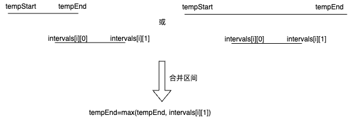

> *题目链接：* https://leetcode.cn/problems/merge-intervals/

# LeetCode 56. 合并区间

## 题目描述

以数组 `intervals` 表示若干个区间的集合，其中单个区间为 intervals[i] = [start<sub>i</sub> , end<sub>i</sub>]。请你合并所有重叠的区间，并返回 *一个不重叠的区间数组，该数组需恰好覆盖输入中的所有区间* 。

**举个例子：**

```
输入：intervals = [[1,3],[2,6],[8,10],[15,18]]
输出：[[1,6],[8,10],[15,18]]
解释：区间 [1,3] 和 [2,6] 重叠, 将它们合并为 [1,6].
```

## 思路解析

* 首先对数组`intervals`**根据区间的起点**进行升序排序。
* 用数组`res`来保存结果，区间`[tempStart, tempEnd]`用来保存数组`intervals`中第一个暂未保存到结果数组`res`中的区间。
* 遍历数组`intervals`，如果区间`[tempStart, tempEnd]`和`intervals[i]`有重合，就更新`tempEnd = max(tempEnd, intervals[i][1])`。否则把区间`[tempStart, tempEnd]`存到`res`中，并更新`[tempStart, tempEnd] = [intervals[i][0], intervals[i][1]]`。



## C++代码

```cpp
class Solution {
public:
    vector<vector<int>> merge(vector<vector<int>>& intervals) {
        
        vector<vector<int>> res;
        if(intervals.size() == 0)
        {
            return res;
        }
        //interval的第一个元素作为key排序
        sort(intervals.begin(),intervals.end(),[](const vector<int>& interval1,const vector<int>& interval2){
            return interval1[0] < interval2[0];
        });
        
        int tempStart = intervals[0][0];
        int tempEnd = intervals[0][1];
        for(int i = 0; i < intervals.size(); ++i)
        {
            //两个区间有重合
            if(intervals[i][0] <= tempEnd)
            {
                tempEnd = max(tempEnd, intervals[i][1]);
            //两个区间没有重合
            } else {
                //保存前面的区间
                res.push_back({tempStart, tempEnd});
                tempStart = intervals[i][0];
                tempEnd = intervals[i][1];
                
            }
        }
        //边界情况，保存最后一个区间
        res.push_back({tempStart, tempEnd});
        return res;
    }
};
```

## 复杂度分析

**时间复杂度：** 只需要遍历一遍`intervals`，所以时间复杂度为*O(n)*，其中`n`为`intervals`的大小。

**空间复杂度：** 需要借助一个数组`res`保存结果，所以空间复杂度为*O(n)*，其中`n`为`intervals`的大小。
