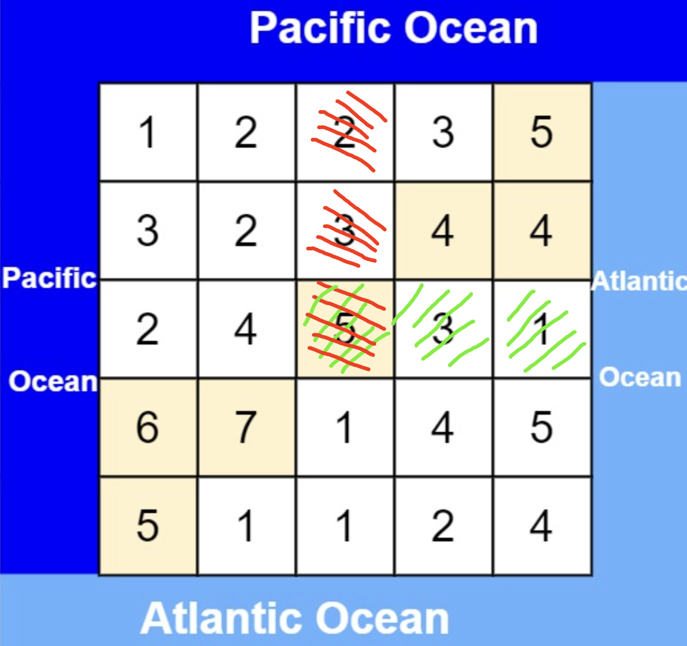

> *题目链接：* https://leetcode.cn/problems/pacific-atlantic-water-flow/

# LeetCode 417.太平洋大西洋水流问题

## 题目描述

有一个 `m × n` 的矩形岛屿，与 **太平洋** 和 **大西洋** 相邻。 **“太平洋”** 处于大陆的左边界和上边界，而 **“大西洋”** 处于大陆的右边界和下边界。

这个岛被分割成一个由若干方形单元格组成的网格。给定一个 `m x n` 的整数矩阵 `heights` ， `heights[r][c]` 表示坐标 `(r, c)` 上单元格 **高于海平面的高度** 。

岛上雨水较多，如果相邻单元格的高度 **小于或等于** 当前单元格的高度，雨水可以直接向北、南、东、西流向相邻单元格。水可以从海洋附近的任何单元格流入海洋。

返回网格坐标 `result` 的 **2D 列表** ，其中 `result[i] = [ri, ci]` 表示雨水从单元格 `(ri, ci)` 流动 **既可流向太平洋也可流向大西洋** 。

**举个例子：**


```
输入: heights = [[1,2,2,3,5],[3,2,3,4,4],[2,4,5,3,1],[6,7,1,4,5],[5,1,1,2,4]]
输出: [[0,4],[1,3],[1,4],[2,2],[3,0],[3,1],[4,0]]
```

## 知识回顾

**深度优先搜索**（Depth-First Search，DFS）是一种常见的图遍历算法，它从图的某个顶点开始遍历，沿着一条路径一直走到底，直到不能再走为止，然后回溯到前一个节点，继续沿着另一条路径走到底，直到所有的节点都被访问过为止。

在实现深度优先搜索时，可以使用**递归**或**栈**来保存遍历的路径。具体来说，从起始节点开始，将其标记为已访问，然后遍历与该节点相邻的未访问节点，对于每个未访问节点，递归调用深度优先搜索函数，直到所有与起始节点相连的节点都被访问过为止。

## 思路解析

首先明确本题的目标：**求水流既可以流向太平洋也可以流向大西洋的坐标的集合。** 下图中的坐标`(2,2)`就是一个满足条件的坐标。



本题可以使用 **深度优先搜索(DFS)** 来解。使用两个数组`pac_visit`保存坐标`(i,j)`的水是否可以流向太平洋，`atl_visit`保存坐标`(i,j)`的水是否可以流向大西洋。

算法如下：

1. 对所有毗邻太平洋的坐标点进行`dfs`，确定所有能流向太平洋的坐标点并保存到`pac_visit`。
2. 对所有毗邻大西洋的坐标点进行`dfs`，确定所有能流向大西洋的坐标点并保存到`atl_visit`。
3. 遍历数组`pac_visit`和`atl_visit`，把既可以流向太平洋又可以流向大西洋的坐标保存到数组`res`，并返回。

这里的深搜(`dfs`)是使用递归实现的，结束的条件是**当前坐标超出矩阵范围**或**当前坐标对应的高度小于上一个坐标对应的高度**（保证水往低处流）或**当前坐标已经被标记过**。

## C++代码

```cpp
class Solution {
public:
    vector<vector<int>> pacificAtlantic(vector<vector<int>>& heights) {
        //保存结果
        vector<vector<int>> res;
        int rows_cnt = heights.size();
        int cols_cnt = heights[0].size();
        //能流向太平洋的坐标
        vector<vector<bool>> pac_visit(rows_cnt, vector<bool>(cols_cnt, false));
        //能流向大西洋的坐标
        vector<vector<bool>> atl_visit(rows_cnt, vector<bool>(cols_cnt, false));
        for (int i = 0; i < cols_cnt; ++i) {
            //对矩阵的上边每个毗邻太平洋的坐标进行dfs
            dfs(heights, 0, i, pac_visit, heights[0][i]);
            //对矩阵下边每个毗邻大西洋的坐标进行dfs
            dfs(heights, rows_cnt - 1, i, atl_visit, heights[rows_cnt - 1][i]);
        }

        for (int i = 0; i < rows_cnt; ++i) {
            //对矩阵左边每个毗邻太平洋的坐标进行dfs
            dfs(heights, i, 0, pac_visit, heights[i][0]);
            对矩阵右边每个毗邻大西洋的坐标进行dfs
            dfs(heights, i, cols_cnt - 1, atl_visit, heights[i][cols_cnt - 1]);
        }

        for (int i = 0; i < rows_cnt; ++i) {
            for (int j = 0; j< cols_cnt; ++j) {
                if (pac_visit[i][j] && atl_visit[i][j]) {
                    //保存既可以流向大西洋又可以流向太平洋的坐标点
                    res.push_back({i,j});
                }
            }
        }

        return res;
    }

    void dfs(vector<vector<int>>& heights, int row, int col, vector<vector<bool>>& visit, int prevHeight) {
        //递归的返回条件，当前坐标超出矩阵范围 或 当前坐标对应的高度小于上一个坐标对应的高度 或 当前坐标已经被标记过
        if (row < 0 || col < 0 || row == heights.size() || col == heights[0].size() || heights[row][col] < prevHeight || visit[row][col]) {
            return;
        }
        visit[row][col] = true;
        //对当前坐标的右边坐标进行dfs
        dfs(heights, row + 1, col, visit, heights[row][col]);
        //对当前坐标的左边坐标进行dfs
        dfs(heights, row - 1, col, visit, heights[row][col]);
        //对当前坐标的下面坐标进行dfs
        dfs(heights, row, col + 1, visit, heights[row][col]);
        //对当前坐标的上面坐标进行dfs
        dfs(heights, row, col - 1, visit, heights[row][col]);
    }
};

```

## 复杂度分析

**时间复杂度：** *O(n)*， `n`为坐标的总数。

**空间复杂度：** *O(n)*， `n`为坐标的总数。


