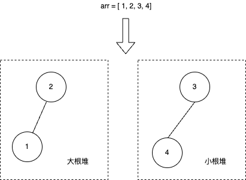

> *题目链接：* https://leetcode.cn/problems/find-median-from-data-stream/

# LeetCode 295. 数据流的中位数

## 题目描述

**中位数**是有序整数列表中的中间值。如果列表的大小是偶数，则没有中间值，中位数是两个中间值的平均值。

* 例如 `arr = [2,3,4]` 的中位数是 `3` 。
* 例如 `arr = [2,3]` 的中位数是 `(2 + 3) / 2 = 2.5` 。

实现 `MedianFinder` 类:

* `MedianFinder()` 初始化 `MedianFinder` 对象。

* `void addNum(int num)` 将数据流中的整数 `num` 添加到数据结构中。

* `double findMedian()` 返回到目前为止所有元素的中位数。与实际答案相差 *10<sup>-5</sup>* 以内的答案将被接受。

**举个例子：**

```
输入
["MedianFinder", "addNum", "addNum", "findMedian", "addNum", "findMedian"]
[[], [1], [2], [], [3], []]
输出
[null, null, null, 1.5, null, 2.0]

解释
MedianFinder medianFinder = new MedianFinder();
medianFinder.addNum(1);    // arr = [1]
medianFinder.addNum(2);    // arr = [1, 2]
medianFinder.findMedian(); // 返回 1.5 ((1 + 2) / 2)
medianFinder.addNum(3);    // arr[1, 2, 3]
medianFinder.findMedian(); // return 2.0
```

## 思路解析

维护一个大根堆`m_small`和一个小根堆`m_large`，在插入元素的过程中始终保持**大根堆`m_small`的最大值** 小于 **小根堆`m_large`的最小值**，且保持**两个堆之间的元素个数相差不超过`1`**，即`｜m_small.size() - m_large.size()｜ <= 1`。

数据流的中位数存在三种情况：
1. `m_small.size() > m_large.size()`，中位数为`m_small.top()`。
2. `m_large.size() > m_small.size()`，中位数为`m_large.top()`。
3. `m_small.size() == m_large.size()`，中位数为`(m_small.top() + m_large.top()) / 2.0`。

比如，`arr = [1, 2, 3, 4]`对应的大根堆和小根堆情况如下图。



其中位数为`(2 + 3) / 2.0 = 2.5`。

## C++代码

```cpp
class MedianFinder {
public:
    MedianFinder() {

    }
    
    void addNum(int num) {
        //元素先插到大根堆
        m_small.push(num);
        //保证大根堆m_small的最大值 小于 小根堆m_large的最小值
        if (m_small.size() && m_large.size() && m_small.top() > m_large.top()) {
            m_large.push(m_small.top());
            m_small.pop();
        }
        //保持两个堆之间元素个数相差不超过1
        if (m_small.size() > m_large.size() + 1) {
            m_large.push(m_small.top());
            m_small.pop();
        }
        //保持两个堆之间元素个数相差不超过1
        if (m_large.size() > m_small.size() + 1) {
            m_small.push(m_large.top());
            m_large.pop();
        }
    }
    
    double findMedian() {
        if (m_large.size() > m_small.size()) {
            return m_large.top();
        }
        if (m_small.size() > m_large.size()) {
            return m_small.top();
        }
        return (m_large.top() + m_small.top()) / 2.0;
    }
private:
    //大根堆
    priority_queue<int, vector<int>, less<int>> m_small;
    //小根堆
    priority_queue<int, vector<int>, greater<int>> m_large;

};

/**
 * Your MedianFinder object will be instantiated and called as such:
 * MedianFinder* obj = new MedianFinder();
 * obj->addNum(num);
 * double param_2 = obj->findMedian();
 */
```

## 复杂度分析

**时间复杂度：** 优先队列中插入元素的时间复杂度为*O(logk)*，其中`k`为优先队列对应堆的高度。查找中位数的时间复杂度为*O(1)*，即取堆顶元素的开销。

**空间复杂度：** *O(n)*，`n`为优先队列中节点的个数。

