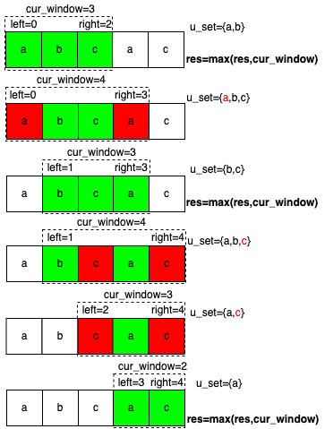

> *题目链接：* https://leetcode.cn/problems/longest-substring-without-repeating-characters/

# LeetCode 3.无重复字符的最长子串

## 题目描述

给定一个字符串 `s` ，请你找出其中不含有重复字符的 **最长子串** 的长度。

```
输入：一个字符串s
输出：s的无重复字符最长子串的长度
举例：s = "abcabcbb", 那么其无重复字符的最长子串为"abc", 所以返回值是3。
```

## 思路解析

字符串相关的题目在面试中出现的频率是特别高的，主要原因有以下几点：

1. 字符串在日常开发中是我们打交道相对比较多的一种数据类型，题目描述比较简单易懂，基本不会出现面试官描述完题目候选人不理解题目本身意思的情况。
2. 字符串可玩性高，排序、递归、回溯、二分查找、动态规划等基本都能基于字符串来出题，很容易考察一个候选人的代码能力。

所以刷题的过程中，字符串相关的题目应该着重去关注。

基本上有点编程基础的同学都能想到一种暴力的算法，两个`for`循环找出所有的子串，针对每个子串去判断是否有重复字符，这样的时间复杂度太高了，很显然这并不是面试官想要的答案。 

下面介绍一种基于 **滑动窗口** 的方式来解此题。所谓滑动窗口，其实就是**由两个索引维护一个区间，满足一定条件时会动态的去调整这个区间**。非常像计算机网络里面`tcp`协议栈里所用到的滑动窗口算法。这里的两个索引的决定了滑动窗口的起点和终点，始终保持滑动窗口中的元素是不重复的，这题就变成了找到**包含非重复元素的最长窗口**。

定义`left = 0`， `right = 0`，结果保存到`res`， 统计窗口中字符的集合`u_set`，区间`[left, right]`即滑动窗口的区间。

问题的关键就是左右边界如何滑动，窗口滑动策略如下：

1. 如果`s[right]`不在`u_set`中，把`s[right]`加入到`u_set`中并更新结果`res = max(res, right - left + 1)`，`right`向右滑动，直到`s[right]`在`u_set`中。
2. 如果`s[right]`在`u_set`中，`u_set`删除`s[left]`，`left`向右滑动，直到`s[right]`不在`u_set`中。

根据上面的策略我们就可以获得以字符串`s`任意位置为右边界(枚举满足条件的右边界)的所有候选窗口，只需要把其中最长的一个窗口的长度返回即可。

看到这里有些同学可能还是不大理解，文字描述的比较抽象，我特意根据一个简单的例子画了个流程图来帮助理解。

比如给定`s="abcac"`,其大致流程如图所示：



## C++代码实现

```cpp
class Solution {
public:
    int lengthOfLongestSubstring(string s) {

        unordered_set<char> u_set;
        int res = 0;
        int len = s.length();
        int cur_window = 0; //当前窗口大小
        for (int left = 0, right = 0; right < len; ++right) {
            while (left < right && u_set.count(s[right])) {
                //s[right]已经在u_set中,窗口区间[left,right]中存在重复的元素
                //移动left直到窗口区间[left,right]中不存在重复元素
                u_set.erase(s[left]); 
                ++left;
                --cur_window;
            } 
            u_set.insert(s[right]);
            ++cur_window;
            res = max(res, cur_window);  
        } 
        return res;
    }
};
```

## 复杂度分析

**时间复杂度：** 不要看到代码用了一个`for`嵌套一个`while`就以为时间复杂度是*O(n<sup>2</sup>)*，`left`，`right`都是不会回头的两个索引，各自最多只遍历一遍字符串，`unordered_set`的查找效率一般是*O(1)*，最坏的情况是*O(n)*这种情况一般是数据量巨大，存在很多哈希冲突，基本上退化成了链表。由于我们字符集大小也就几百个，不会出现这种最坏的情况。故总的时间复杂度为*O(n)*， `n`为字符串长度。

**空间复杂度：** 用了三个`int`型变量，一个`set`，`set`的最大元素个数为字符集的个数，所以空间复杂度为`3 * O(1) + O(m) = O(m)`，`m`为字符集的大小。 


