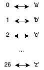

> *题目链接：* https://leetcode.cn/problems/group-anagrams/

# LeetCode 49. 字母异位词分组

## 题目描述

给你一个字符串数组，请你将 **字母异位词** 组合在一起。可以按任意顺序返回结果列表。

**字母异位词** 是由重新排列源单词的所有字母得到的一个新单词。

**举个例子：**

```cpp
输入: strs = ["eat", "tea", "tan", "ate", "nat", "bat"]
输出: [ ["bat"], ["nat","tan"], ["ate","eat","tea"] ]
```

## 思路解析

本题的关键是找到字母异位词公共的特征，然后基于这个公共特征对所以的单词进行分类，这里介绍两种分类方法。

### 方法一 排序法

对每个单词拷贝一个副本，然后对单词的副本进行排序，**排序后相等的单词**存到同一个数组中。这里借用一个`hash`表，排序后的单词作为`hash`表的`key`。

对于`strs = ["eat", "tea", "tan", "ate", "nat", "bat"]`，在`hash`表中的分布如下图：


### C++代码

```cpp
class Solution {
public:
    vector<vector<string>> groupAnagrams(vector<string>& strs) {
        vector<vector<string>> res;
        unordered_map<string, vector<string>> u_mapRes;
        for (auto& str : strs) {
            //对副本进行排序
            string key(str);
            sort(key.begin(), key.end());
            //存到hash表中
            u_mapRes[key].push_back(str);
        }
        for (auto& pair : u_mapRes) {
            res.push_back(pair.second);
        }
        return res;
    }
};
```

### 复杂度分析

**时间复杂度：** 排序需要*O(nlogn)*，遍历数组需要*O(n)*，所以整体的时间复杂度为*O(nlogn)*，其中`n`是数组的长度。

**空间复杂度：** 需要借用一个`hash`表，最坏情况有`n`个`key`，所以空间复杂度为*O(n)*，其中`n`是数组的长度。

### 方法二 字母统计法

方法一中对单词进行排序需要 *O(nlogn)* 的时间复杂度，这里我们可以通过**对单词中的字母进行统计替代排序**来优化。因为单词只包含小写字母，字母总共`26`个，可以采用一个**长为`26`的字符串**来统计每个单词中的字母数量，然后将这个字符串作为方法一中`hash`表的`key`。

字符串的索引和字母的对应关系如下图：



>思考：能否使用`vector`作为`hash`表的`key`？需要做哪些额外操作？

### C++代码

```cpp
class Solution {
public:
    vector<vector<string>> groupAnagrams(vector<string>& strs) {
        vector<vector<string>> res;
        unordered_map<string, vector<string>> u_mapRes;
        for (auto& str : strs) {
            string count(26, '0');

            for (auto& c : str) {
                count[c - 'a'] += 1;
            }
            u_mapRes[count].push_back(str);
        }
        for (auto& pair : u_mapRes) {
            res.push_back(pair.second);
        }
        return res;
    }
};
```
### 复杂度分析

**时间复杂度：** 只需要遍历一遍数组统计字符，所以时间复杂度为*O(n)*，其中`n`是数组的长度。

**空间复杂度：** 需要借用一个`hash`表，最坏情况有`n`个`key`，所以空间复杂度为*O(n)*，其中`n`是数组的长度。

