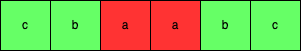

> *题目链接：* https://leetcode.cn/problems/palindromic-substrings/

# LeetCode 647. 回文子串

## 题目描述

给你一个字符串 `s` ，请你统计并返回这个字符串中 **回文子串** 的数目。

**回文字符串** 是正着读和倒过来读一样的字符串。

**子字符串** 是字符串中的由连续字符组成的一个序列。

具有不同开始位置或结束位置的子串，即使是由相同的字符组成，也会被视作不同的子串。

**举个例子：**

```
输入：s = "abc"
输出：3
解释：三个回文子串: "a", "b", "c"
```

## 思路解析

首先我们可以通过暴力遍历的方式枚举字符串`s`所有的子串，统计其中回文串的个数，但是时间复杂度太高，这里不再详细的讲解。下面介绍一种中心扩散法。

分两情况来考虑：

1. **回文子串的长度为奇数**，这时我们就枚举回文子串所有可能的中心`s[i]`，`0 <= i < s.length`，以中心`s[i]`向两边扩散寻找所有的回文子串。如下图`a`就是回文串`"cbabc"`的中心。


2. **回文子串的长度为偶数**，这时我们就枚举回文子串所有可能的中心`s[i]s[i+1]`，`0 <= i < s.length - 1`，以中心`s[i]s[i+1]`向两边扩散寻找所有的回文子串。如下图`aa`就是回文串`"cbaabc"`的中心。



所以本题的关键是**枚举回文子串的中心**。

## C++代码

```cpp
class Solution {
public:
    int countSubstrings(string s) {
        int res = 0;
        int s_len = s.length();
        for (int i = 0; i < s_len; ++i) {
            //若回文串长度为奇数,以s[i]为中心向两边扩散寻找以s[i]为中心的所有回文子串
            int left = i, right = i;
            while (left >= 0 && right < s_len && s[left] == s[right]) {
                ++res;
                --left;
                ++right;
            }
            //若回文串长度为偶数，以s[i]s[i+1]为中心向两边扩散寻找以s[i]s[i+1]为中心的所有回文子串
            left = i;
            right = i + 1;
            while (left >= 0 && right < s_len && s[left] == s[right]) {
                ++res;
                --left;
                ++right;
            }
        }
        return res;
    }
};
```

## 复杂度分析

**时间复杂度：** 整个过程会遍历`s`中每个元素为中心的所有回文子串，所以时间复杂度是*O(n<sup>2</sup>)*，其中`n`是字符串`s`的长度。

**空间复杂度：** 整个过程只用到几个整型变量，所以空间复杂度为*O(1)*。

