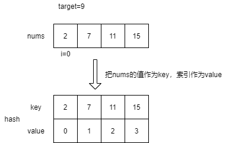

# LeetCode 1.两数之和

> *题目链接：* https://leetcode.cn/problems/two-sum/

## 题目描述

给定一个整数数组 `nums` 和一个整数目标值 `target`，请你在该数组中找出 **和为目标值 `target`**  的那 **两个** 整数，并返回它们的数组下标。

你可以假设每种输入只会对应一个答案。但是，数组中同一个元素在答案里不能重复出现。

你可以按任意顺序返回答案。

**举个例子：**
```
输入：nums = [2,7,11,15], target = 9
输出：[0,1]
解释：因为 nums[0] + nums[1] == 9 ，返回 [0, 1] 。
```

## 思路解析

首先暴力的方法就不说了，比较简单但是时间复杂度比较高。这里讲一种空间换时间的方法，利用`hash`表，提前把`nums`中的元素`nums[i]`作为`hash`表的`key`主键，`nums`的索引作为`hash`表的`value`值存到`hash`表中。



这样我们只需要遍历`nums`，在`hash`表中寻找`target-nums[i]`，如果`target-nums`存在`hash`表中，且`hash[target-nums] != i`，那么就返回`{i,hash[target-nums]}`。如果遍历完整个`nums`都没有任何结果返回，就说明没有找到。

## C++代码

```cpp
class Solution {
public:
    vector<int> twoSum(vector<int>& nums, int target) {
        unordered_map<int, int> u_map;
        int nums_len = nums.size();
        //预先生成hash表
        for (int i = 0; i < nums_len; ++i) {
            u_map[nums[i]] = i; 
        }
        for (int i = 0; i < nums_len; ++i) {
            //查询由nums所有元素生成的hash表
            if(u_map.find(target-nums[i]) != u_map.end() && u_map[target-nums[i]] != i) {
                return {i, u_map[target-nums[i]]};
            } 
        }
        return {};
    }
};
```

上面的方法我们需要预先生成`hash`表，这样就会遍历两次`nums`，那么能否只遍历一遍`nums`呢？对于`nums[i]`，我们只需要把每次查询由`nums`中所有元素组成的`hash`表，修改为每次查询由`nums[0]~nums[i-1]`组成的`hash`表，其实效果是一样的。

## C++代码

```cpp
class Solution {
public:
    vector<int> twoSum(vector<int>& nums, int target) {
        unordered_map<int, int> u_map;
        int nums_len = nums.size();
        for (int i = 0; i < nums_len; ++i) {
            //查询由nums[0]~nums[i-1]组成的hash表
            if(u_map.find(target-nums[i]) != u_map.end()) {
                return {u_map[target-nums[i]], i};
            } else {
                //把当前nums[i]放入hash表
                u_map[nums[i]] = i;
            }
        }
        return {};
    }
};

```
## 复杂度分析

**时间复杂度：** 只需要遍历一遍`nums`，每次查`hash`表的时间复杂度是*O(1)*，故整体的时间复杂是*O(n)*，其中`n`为`nums`的长度。

**空间复杂度：** 需要借用一个`hash`表，其大小为`n`，`n`为`nums`的长度，所以空间复杂度为*O(n)*。

