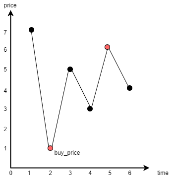

# LeetCode 121.买卖股票的最佳时机

> *题目链接：* https://leetcode.cn/problems/best-time-to-buy-and-sell-stock/

## 题目描述

给定一个数组 `prices` ，它的第 `i` 个元素 `prices[i]` 表示一支给定股票第 `i` 天的价格。

你只能选择 **某一天** 买入这只股票，并选择在 **未来的某一个不同的日子** 卖出该股票。设计一个算法来计算你所能获取的最大利润。

返回你可以从这笔交易中获取的最大利润。如果你不能获取任何利润，返回 0 。

**举个例子：**

```
输入：[7,1,5,3,6,4]
输出：5
解释：在第 2 天（股票价格 = 1）的时候买入，在第 5 天（股票价格 = 6）的时候卖出，最大利润 = 6-1 = 5 。
注意利润不能是 7-1 = 6, 因为卖出价格需要大于买入价格；同时，你不能在买入前卖出股票。
```

## 思路解析

暴力枚举比较简单但时间复杂度比较高，我们直接跳过。买卖股票讲究的就是逢低买入，同时还要关注买卖的时序，要先买才能卖。

定义三个变量，`buy_price`表示买入价，`cur_price`表示当前价格，`max_profit`表示最大利润。



下面给出核心算法：

1. 如果`cur_price < buy_price`，就更新`buy_price = cur_price`(符合逢低买入的思想)。否则就计算**以当前价格卖出获得的利润**，如果利润大于`max_profit`，就更新`max_profit = cur_price - buy_price`。进入`步骤2`。
2. 重复执行`步骤1`，直到遍历完`prices`数组。

根据上面的算法，在股票卖出时我们始终保证**买入价`buy_price`是目前为止最低的**，这就是解决本题的关键，只要遍历一遍数组`prices`就可得到最大利润值。

## C++代码

```cpp
class Solution {
public:
    int maxProfit(vector<int>& prices) {
        int prices_len = prices.size();
        int buy_price = prices[0];
        int max_profit = 0;
        for (int i = 1; i < prices_len; ++i) {
            if (prices[i] < buy_price) {
                //逢低买入
                buy_price = prices[i];
            } else if (prices[i] - buy_price > max_profit) {
                //更新最大利润    
                max_profit = prices[i] - buy_price; 
            }
        }
        return max_profit;
    }
};
```
## 复杂度分析

**时间复杂度：** 整个过程只遍历一遍数组，时间复杂度为*O(n)*，`n`为`prices`数组的长度。

**空间复杂度：** 只使用了`3`个整型变量，所以空间复杂度为*O(1)*。
