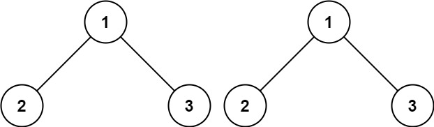
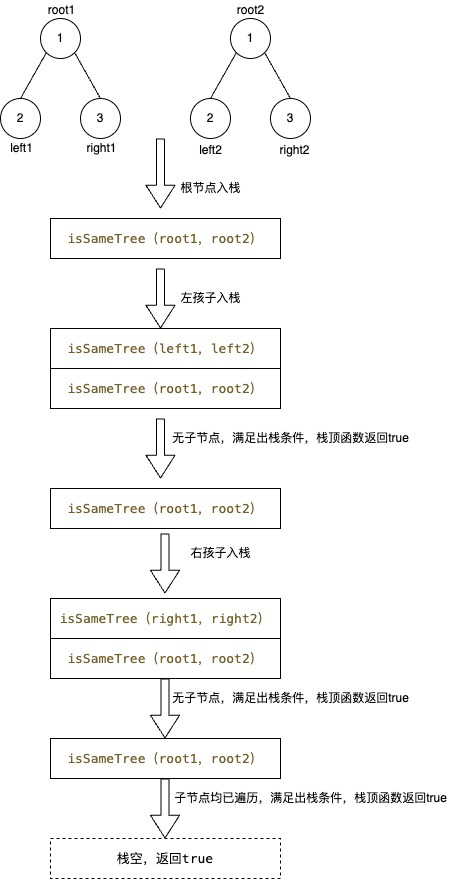

> *题目链接：* https://leetcode.cn/problems/same-tree/

# LeetCode 100. 相同的树

## 题目描述

给你两棵二叉树的根节点 `p` 和 `q` ，编写一个函数来检验这两棵树是否相同。

如果两个树在结构上相同，并且节点具有相同的值，则认为它们是相同的。

**举个例子：**



```
输入：p = [1,2,3], q = [1,2,3]
输出：true
```

## 思路解析

递归可以分为两步：**递归结束条件的处理**和**独立子问题的划分**。

在这里**两棵树是否相同**可以划分**两棵树的左子树是否相同**和**两棵树的右子树是否相同**两个独立子问题。

只要保证两棵树的根节点的值相同且左右子树均相同，那么这两棵树就是相同的。

递归是函数一层一层调用的过程，函数调用实际上是一个入栈出栈的过程，这里的栈就是函数调用栈，你可以用`gdb`调试一个程序通过`bt`命令来查看函数调用栈。这里的递归函数是`isSameTree`，它的入参是两棵树的根节点，返回值为是否相同。

整个递归的过程如下图：



## C++代码

```cpp
/**
 * Definition for a binary tree node.
 * struct TreeNode {
 *     int val;
 *     TreeNode *left;
 *     TreeNode *right;
 *     TreeNode() : val(0), left(nullptr), right(nullptr) {}
 *     TreeNode(int x) : val(x), left(nullptr), right(nullptr) {}
 *     TreeNode(int x, TreeNode *left, TreeNode *right) : val(x), left(left), right(right) {}
 * };
 */
class Solution {
public:
    bool isSameTree(TreeNode* p, TreeNode* q) {
        //函数出栈的条件
        if (!p && !q) {
            return true;
        }
        //函数出栈的条件
        if (!p || !q || p->val != q->val) {
            return false;
        }
        //子问题
        return isSameTree(p->left, q->left) && isSameTree(p->right, q->right);
    }
};
```

## 复杂度分析

**时间复杂度：**  因为需要遍历两棵树所有的节点，所以时间复杂度跟两棵树的总节点数相关。

**空间复杂度：** 因为使了递归，需要用到一个栈来保存函数的调用，栈的最大长度为树的高度，所以空间复杂度跟树的高度有关。
