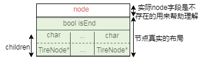
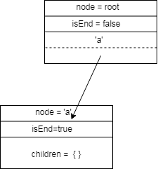

> *题目链接：* https://leetcode.cn/problems/implement-trie-prefix-tree/

# LeetCode 208. 实现 Trie (前缀树)

## 题目描述

`Trie`（发音类似 "try"）或者说 **前缀树** 是一种树形数据结构，用于高效地存储和检索字符串数据集中的键。这一数据结构有相当多的应用情景，例如自动补完和拼写检查。

请你实现 `Trie` 类：

* `Trie()` 初始化前缀树对象。
* `void insert(String word)` 向前缀树中插入字符串 `word` 。
* `boolean search(String word)` 如果字符串 `word` 在前缀树中，返回 `true`（即，在检索之前已经插入）；否则，返回 `false` 。
* `boolean startsWith(String prefix)` 如果之前已经插入的字符串 `word` 的前缀之一为 `prefix` ，返回 `true` ；否则，返回 `false` 。

**举个例子：**

 ```
 输入
["Trie", "insert", "search", "search", "startsWith", "insert", "search"]
[[], ["apple"], ["apple"], ["app"], ["app"], ["app"], ["app"]]
输出
[null, null, true, false, true, null, true]

解释
Trie trie = new Trie();
trie.insert("apple");
trie.search("apple");   // 返回 True
trie.search("app");     // 返回 False
trie.startsWith("app"); // 返回 True
trie.insert("app");
trie.search("app");     // 返回 True
 ```

## 思路解析

本题要求实现一个前缀树的类，主要是想考察面向对象编程的能力。

类似二叉树，首先需要定义出树的节点。二叉树最多只有两个孩子节点，二叉树的节点一般定义如下。

```cpp
struct TreeNode {
      int val;
      TreeNode *left;
      TreeNode *right;
      //这里忽略构造函数
};
```

这里的前缀树最多有`26`个孩子节点。在每个节点中，使用一个`hash`表来保存`字符`与`孩子节点`之间的对应关系。前缀树节点定义如下。

```cpp
struct TrieNode {
    //字符和指向孩子节点指针的映射关系
    unordered_map<char, TrieNode*> children;
    //node节点是否是某个字符串的结尾
    bool isEnd;
    //这里忽略构造函数
};
```

相比二叉树，前缀树节点的孩子节点比较多，而且前缀树节点中没有`val`值，其实它的`val`值可以通过`父节点`的`children`这个`hash`表推算出来，所以没有必要再增加一个`val`字段。

前缀树节点的结构如下图，图中的`node`字段在真实结构体中是不存在的，为了方便理解`node`相当于二叉树的`val`字段，弄清楚图中节点的布局是搞懂前缀树的关键。



由`"a"`生成的前缀树如下图。



前缀树的根节点是没有类似二叉树`val`字段信息的，字符串`"a"`中只有一个字符，生成的前缀树需要两个节点，孩子节点表示字符`‘a’`，孩子节点中的`isEnd = true`表示这个节点为字符串`“a”`在前缀树中的最后一个节点。

1. **前缀树的插入**

遍历字符串，从前缀树的根节点开始，如果字符串中的字符不在节点的`children`中，就创建新节点，并把新节点和字符之间的关系保存在原节点的`children`中，直到遍历完字符串。

```cpp
void insert(string word) {
    TrieNode* cur_node = m_root;
      //根据word构建前缀树
    for (int i = 0; i < word.length(); ++i) {
        if (cur_node->children.count(word[i]) == 0) {
            //建立新节点和字符之间的映射关系
            cur_node->children[word[i]] = new TrieNode();
        }
        cur_node = cur_node->children[word[i]];
    }
    cur_node->isEnd = true;
}
```

2. **前缀树的搜索**

遍历字符串，从前缀树的根节点开始，如果字符串中的字符都能依次在前缀树节点的`children`中找到，并且当遍历完字符串，相应的前缀树节点的字段`isEnd == true`，说明字符串在前缀树中。

```cpp
bool search(string word) {
      TrieNode* cur_node = m_root;
      //搜索前缀树
      for (int i = 0; i < word.length(); ++i) {
          if (cur_node->children.count(word[i]) == 0) {
              return false;
          }
          cur_node = cur_node->children[word[i]];
      }
      return cur_node->isEnd;
}
```

3. **判断字符串是否是前缀树的前缀**

遍历字符串，从前缀树的根节点开始，如果字符串中的字符都能依次在前缀树节点的`children`中找到，说明字符串在前缀树中。流程和前缀树的搜索基本一致，只是不需要判断前缀树节点的`isEnd`字段。

```cpp
bool startsWith(string prefix) {
    TrieNode* cur_node = m_root;
    for (int i = 0; i < prefix.length(); ++i) {
        if (cur_node->children.count(prefix[i]) == 0) {
            return false;
        }
        cur_node = cur_node->children[prefix[i]];
    }
    return true;
}
```

## C++代码

```cpp
struct TrieNode {
    //字符和孩子指针的映射
    unordered_map<char, TrieNode*> children;
    //node节点中的字符是否是某个字符串的结尾
    bool isEnd;
    TrieNode() {
        children.clear();
        isEnd = false;
    }
};

class Trie {
public:
    Trie() {
        //创建根节点
        m_root = new TrieNode();
    }
    
    void insert(string word) {
        TrieNode* cur_node = m_root;
        //根据word构建前缀树
        for (int i = 0; i < word.length(); ++i) {
            //建立新节点和字符之间的映射关系
            if (cur_node->children.count(word[i]) == 0) {
                cur_node->children[word[i]] = new TrieNode();
            }
            cur_node = cur_node->children[word[i]];
        }
        cur_node->isEnd = true;
    }
    
    bool search(string word) {
        TrieNode* cur_node = m_root;
        //搜索前缀树
        for (int i = 0; i < word.length(); ++i) {
            if (cur_node->children.count(word[i]) == 0) {
                return false;
            }
            cur_node = cur_node->children[word[i]];
        }
        return cur_node->isEnd;
    }
    
    bool startsWith(string prefix) {
        TrieNode* cur_node = m_root;
        for (int i = 0; i < prefix.length(); ++i) {
            if (cur_node->children.count(prefix[i]) == 0) {
                return false;
            }
            cur_node = cur_node->children[prefix[i]];
        }
        return true;
    }
private:
    TrieNode* m_root;
};

/**
 * Your Trie object will be instantiated and called as such:
 * Trie* obj = new Trie();
 * obj->insert(word);
 * bool param_2 = obj->search(word);
 * bool param_3 = obj->startsWith(prefix);
 */
```

## 复杂度分析

**时间复杂度：**  插入和查找均和字符串的长度有关。

**空间复杂度：**  和整棵树的节点数的个数有关。


