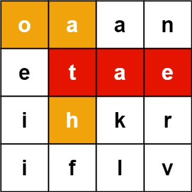
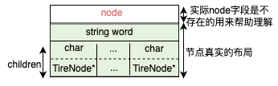

> *题目链接：* https://leetcode.cn/problems/word-search-ii/

# LeetCode 212. 单词搜索 II

## 题目描述

给定一个 `m x n` 二维字符网格 `board` 和一个单词（字符串）列表 `words`， *返回所有二维网格上的单词* 。

单词必须按照字母顺序，通过 **相邻的单元格** 内的字母构成，其中“相邻”单元格是那些水平相邻或垂直相邻的单元格。同一个单元格内的字母在一个单词中不允许被重复使用。

**举个例子：**



```
输入：board = [["o","a","a","n"],["e","t","a","e"],["i","h","k","r"],["i","f","l","v"]], words = ["oath","pea","eat","rain"]
输出：["eat","oath"]
```

## 思路解析

本题可以对前缀树稍加改造，用来保存给定的单词。

首先复习一下前缀树。

类似二叉树，首先需要定义出树的节点。二叉树最多只有两个孩子节点，二叉树的节点一般定义如下。

```cpp
struct TreeNode {
      int val;
      TreeNode *left;
      TreeNode *right;
      //这里忽略构造函数
};
```

这里的前缀树最多有`26`个孩子节点。在每个节点中，使用一个`hash`表来保存`节点值`与`孩子节点`之间的对应关系。前缀树节点定义如下。

```cpp
struct TrieNode {
    //字符和指向孩子节点指针的映射关系
    unordered_map<char, TrieNode*> children;
    //既可以用来判断当前节点是否为单词的结尾，又可以保存单词
    string word;
    //这里忽略构造函数
};
```
相比二叉树，前缀树节点的孩子节点比较多，而且前缀树节点中没有`val`值，其实它的`val`值可以通过`父节点`的`children`这个`hash`表推算出来，所以没有必要再增加一个`val`字段。

前缀树节点的结构如下图，图中的`node`字段在真实结构体中是不存在的，为了方便理解`node`相当于二叉树的`val`字段，弄清楚图中节点的布局是搞懂前缀树的关键。



由单词`"a"`生成的前缀树如下图。


前缀树的根节点是没有类似二叉树`val`字段信息的，单词`"a"`中只有一个字符，生成的前缀树需要两个节点，孩子节点表示字符`‘a’`，孩子节点中的`word`字段不为空表示这个节点为单词`“a”`在前缀树中的最后一个节点。

单词搜索算法如下：

1. 把给定的单词插入到上面定义的前缀树中。

```cpp
void insert(string word) {
    TrieNode* cur_node = this;
    for (int i = 0; i < word.length(); ++i) {
        if (cur_node->children.count(word[i]) == 0) {
            //建立新节点和字符之间的映射关系
            cur_node->children[word[i]] = new TrieNode();
        }
        cur_node = cur_node->children[word[i]];
    }
    cur_node->word = word;
}
```
2. 深度优先搜索字符矩阵`board`，一边搜索一边匹配前缀树。

```cpp
 void findWords_help(vector<vector<char>>& board, int row, int col, TrieNode* node, set<string>& res) {
        //回溯条件
        if (row < 0 || col < 0 || row >= board.size() || col >= board[0].size() || board[row][col] == '*' || !(node->children.count(board[row][col]))) {
            return;
        }

        node = node->children[board[row][col]];
        if (node->word != "" && !res.count(node->word)) {
            //这里不能return，因为当前找到的单词有可能是另一个单词的前缀
            res.emplace(node->word);
        }
        char c = board[row][col];
        board[row][col] = '*';
        //搜索前后左右相邻的字符
        findWords_help(board, row - 1, col, node, res);
        findWords_help(board, row + 1, col, node, res);
        findWords_help(board, row, col - 1, node, res);
        findWords_help(board, row, col + 1, node, res);
        board[row][col] = c;
  }
```

## C++代码

```cpp
struct TrieNode {
    //字符和指向孩子节点指针的映射关系
    unordered_map<char, TrieNode*> children;
    //既可以用来判断当前节点是否为单词的结尾，又可以保存单词
    string word;

    TrieNode() {
        word = "";
    }
    void insert(string word) {
        TrieNode* cur_node = this;
        for (int i = 0; i < word.length(); ++i) {
            if (cur_node->children.count(word[i]) == 0) {
                //建立新节点和字符之间的映射关系
                cur_node->children[word[i]] = new TrieNode();
            }
            cur_node = cur_node->children[word[i]];
        }
        cur_node->word = word;
    }
};

class Solution {
public:
    vector<string> findWords(vector<vector<char>>& board, vector<string>& words) {
        TrieNode* root = new TrieNode();
        //根据给定的单词构造前缀树
        for (int i = 0; i < words.size(); ++i) {
            root->insert(words[i]);
        }

        vector<string> res;
        //使用set是为了对结果去重
        set<string> tmp_res;
        for (int row = 0; row < board.size(); ++row) {
            for (int col = 0; col < board[0].size(); ++col) {  //矩阵的每一个元素做为起点开始搜索
                findWords_help(board, row, col, root, tmp_res);
            }
        }
        for (auto str : tmp_res) {
            res.push_back(str);
        }
        return res;
    }
    void findWords_help(vector<vector<char>>& board, int row, int col, TrieNode* node, set<string>& res) {
        //回溯条件
        if (row < 0 || col < 0 || row >= board.size() || col >= board[0].size() || board[row][col] == '*' || !(node->children.count(board[row][col]))) {
            return;
        }

        node = node->children[board[row][col]];
        if (node->word != "" && !res.count(node->word)) {
            //这里不能return，因为当前找到的单词有可能是另一个单词的前缀
            res.emplace(node->word);
        }
        char c = board[row][col];
        board[row][col] = '*';
        //搜索前后左右相邻的字符
        findWords_help(board, row - 1, col, node, res);
        findWords_help(board, row + 1, col, node, res);
        findWords_help(board, row, col - 1, node, res);
        findWords_help(board, row, col + 1, node, res);
        board[row][col] = c;
    }
};
```

## 复杂度分析

**时间复杂度：** 因为这棵前缀树为四叉树树，时间复杂度为*O(mnt4<sup>t-1</sup>)*，其中`m`为`board`的行数，`n`为`board`的列数，`t`为最长单词的长度，4<sup>t-1</sup>是前缀树的叶子数，即一棵树最大搜索路径数。

**空间复杂度：** 空间复杂度跟前缀树的总节点数相关。

