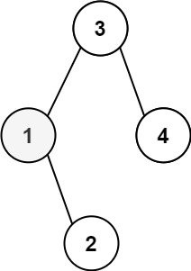
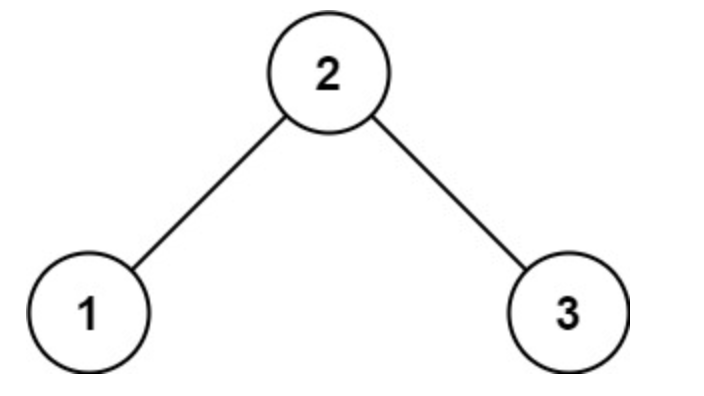

> *题目链接：* https://leetcode.cn/problems/kth-smallest-element-in-a-bst/

# LeetCode 230. 二叉搜索树中第K小的元素

## 题目描述

给定一个二叉搜索树的根节点 `root` ，和一个整数 `k` ，请你设计一个算法查找其中第 `k` 个最小元素（从 `1` 开始计数）。

**举个例子：**



```
输入：root = [3,1,4,null,2], k = 1
输出：1
```

## 知识回顾

二叉树的**中序遍历**步骤如下：

1. 遍历二叉树的左子树。
2. 遍历二叉树的根节点。
3. 遍历二叉树的右子树。

## 思路解析

对二叉搜索树进行中序遍历，其节点值组成的序列是单调递增的。

比如对于下图的二叉搜索树进行中序遍历，得到一个单调递增的序列`[1,2,3]`。



这里要得到二叉搜索树第`k`小的元素，最简单的方法就是对二叉搜索树进行中序遍历，遍历过程中把访问到的节点的值存到一个数组`vals`里，最终只需要返回数组`vals`的第`k`个元素即可。

上面的方法需要遍历整棵二叉搜索树，很多时候我们是不需要遍历完整棵树的，这里可以在中序遍历二叉树的时候采用非递归的实现方式，在访问到第`k`个元素的时候就结束遍历。

## C++代码

```cpp
/**
 * Definition for a binary tree node.
 * struct TreeNode {
 *     int val;
 *     TreeNode *left;
 *     TreeNode *right;
 *     TreeNode() : val(0), left(nullptr), right(nullptr) {}
 *     TreeNode(int x) : val(x), left(nullptr), right(nullptr) {}
 *     TreeNode(int x, TreeNode *left, TreeNode *right) : val(x), left(left), right(right) {}
 * };
 */
class Solution {
public:
    int kthSmallest(TreeNode* root, int k) {
        int cnt = 0;
        stack<TreeNode*> s;
        TreeNode* cur_node = root;
        while (cur_node || !s.empty()) {
            //左孩子入栈
            while (cur_node) {
                s.push(cur_node);
                cur_node = cur_node->left;
            }
            //访问栈顶的节点
            cur_node = s.top();
            s.pop();
            ++cnt;
            if (cnt == k) {
                return cur_node->val;
            }
            //右孩子入栈
            cur_node = cur_node->right;
        }
        return cur_node->val;
    }
};
```

## 复杂度分析

**时间复杂度：** 需要遍历前`k`个节点，但是如果二叉树的高度`hight`比`k`大，需要先把左孩子一直压栈，所以时间复杂度跟二叉树的高度`hight`和`k`值均相关。

**空间复杂度：** 整个过程会用到一个栈，栈的长度最长为树的高度，所以空间复杂度跟树的高度相关。
