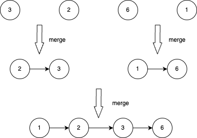

> *题目链接：* https://leetcode.cn/problems/merge-k-sorted-lists/

# LeetCode 23. 合并 K 个升序链表

## 题目描述

给你一个链表数组，每个链表都已经按升序排列。

请你将所有链表合并到一个升序链表中，返回合并后的链表。

**举个例子：**

```
输入：lists = [[1,4,5],[1,3,4],[2,6]]
输出：[1,1,2,3,4,4,5,6]
解释：链表数组如下：
[
  1->4->5,
  1->3->4,
  2->6
]
将它们合并到一个有序链表中得到。
1->1->2->3->4->4->5->6
```

## 思路解析

### 方法一 两两合并

假设数组中有`4`个链表，`lists = [[3],[2],[6],[1]]`。

1. 对于数组中的链表进行两两合并。比如，链表`[3]`和`[2]`合并成`[2,3]`，链表`[6]`和`[1]`合并成`[1,6]`。
2. 更新`lists = [[2,3],[1,6]]`。当`lists`中链表的个数大于`1`就进入`步骤1`，否则进入`步骤3`。
3. 返回`lists[0]`。

合并过程如下图。



### C++代码

```cpp
/**
 * Definition for singly-linked list.
 * struct ListNode {
 *     int val;
 *     ListNode *next;
 *     ListNode() : val(0), next(nullptr) {}
 *     ListNode(int x) : val(x), next(nullptr) {}
 *     ListNode(int x, ListNode *next) : val(x), next(next) {}
 * };
 */
class Solution {
public:
    ListNode* mergeKLists(vector<ListNode*>& lists) {
       if (lists.size() == 0) {
           return nullptr;
       }

       while (lists.size() > 1) {
           vector<ListNode*> tempList;
           for (int i = 0; i < lists.size(); i+=2) {
               //每两个链表合并成一个
               ListNode* l1 = lists[i];
               ListNode* l2 = nullptr;
               if (i + 1 < lists.size()) {
                   l2 = lists[i+1];
               }
               tempList.push_back(mergeTwoLists(l1, l2));
           }
           lists = tempList;
       }
       return lists[0];
    }

    ListNode* mergeTwoLists(ListNode* list1, ListNode* list2) {
        //创建一个虚拟的头节点方便后面操作
        ListNode* newHead = new ListNode();
        ListNode* tail = newHead;
        while (list1 && list2) {
            //选取val较小的节点放到tail后面
            if (list1->val <= list2->val) {
                tail->next = list1;
                list1 = list1->next;
            } else {
                tail->next = list2;
                list2 = list2->next;
            }
            //保证tail一直指向新链表的最后一个节点
            tail = tail->next;
        }
        //把剩下的有序节点挂到tail后面
        if (list1) {
            tail->next = list1;
        } else if (list2) {
            tail->next = list2;
        }
        return newHead->next;
    }
};
```

### 复杂度分析

**时间复杂度：** *O(nlogk)*，其中`n`是合并后链表总的长度，`k`是链表的个数，两两合并总共需要合并*logk*次。

**空间复杂度：** *O(k)*，会使用临时数组存储两两合并后的新链表。这个是可以优化的，复用已有`lists`，需要调整`lists`的大小。

### 方法二 使用小根堆

本题也可以利用小根堆的特点来解，c++中可以使用优先队列（可以实现堆的操作）。

把链表的节点指针作为优先队列的元素，这里需要实现一个仿函数`cmp`作为优先队列模板类的参数，用作链表节点的排序。

```cpp
class cmp {
public:
     bool operator()(ListNode* left, ListNode* right) {
         // 表示根据节点的val值从左到右递减排序
         return left->val > right->val;
     }
 };
```

假设有`k`个链表，使用优先队列的算法如下：

1. 把`k`个链表中未被合并的第一个节点放到优先队列`q`中。
2. 取优先队列的顶部节点`q.top()`放入新的链表中，如果`(q.top())->next != NULL`，就把`(q.top())->next`放入优先队列。
3. 重复`步骤2`直至队列`q`为空。

### C++代码

```cpp
/**
 * Definition for singly-linked list.
 * struct ListNode {
 *     int val;
 *     ListNode *next;
 *     ListNode() : val(0), next(nullptr) {}
 *     ListNode(int x) : val(x), next(nullptr) {}
 *     ListNode(int x, ListNode *next) : val(x), next(next) {}
 * };
 */
class cmp {
public:
     bool operator()(ListNode* left, ListNode* right) {
         // 表示根据节点的val值从左到右递减排序
         // 用来实现小根堆
         return left->val > right->val;
     }
 };
class Solution {
public:
    ListNode* mergeKLists(vector<ListNode*>& lists) {
       priority_queue<ListNode*, vector<ListNode*>,cmp> q;
       //把每个链表第一个节点放到队列中
       for (auto list : lists) {
           if (list)
            q.push(list);
       }
       ListNode* head = nullptr;
       ListNode* pIndex = nullptr;
       while (!q.empty()) {
           if (!head) {
               head = q.top();
               pIndex = head;
               q.pop();
           } else if (pIndex) {
               pIndex->next = q.top();
               q.pop();
               pIndex = pIndex->next;
           }
           //把链表中被合并节点的下一个节点放入队列
           if (pIndex && pIndex->next) q.push(pIndex->next);
       }
       if (pIndex)
            pIndex->next = nullptr;
       return head;
    }
};
```
### 复杂度分析

**时间复杂度：** *O(nlogk)*，其中`n`是合并后链表总的长度，`k`是链表的个数，优先队列中节点插入的时间复杂度为*O(logk)*。

**空间复杂度：** *O(k)*，优先队列中最多有`k`个元素。

