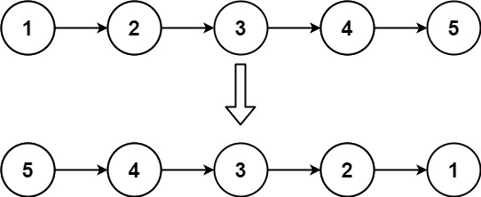
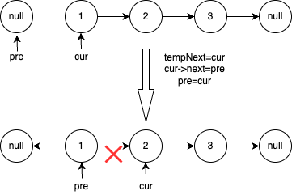
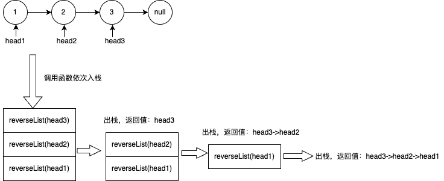

> *题目链接：* https://leetcode.cn/problems/reverse-linked-list/

# LeetCode 206. 反转链表

## 题目描述

给你单链表的头节点 `head` ，请你反转链表，并返回反转后的链表。

**举个例子：**



```
输入：head = [1,2,3,4,5]
输出：[5,4,3,2,1]
```

## 思路解析

### 方法一 迭代法

* 定义两个指针`pre = NULL`，`cur = head`。
* 遍历链表，当`cur`不为空，就让`cur`指向它的前一个节点`pre`，然后`pre`和`cur`均向后移动一步。



* 最终`cur == NULL`，`pre`变成新的头节点，返回`pre`即可。

### C++代码

```cpp
/**
 * Definition for singly-linked list.
 * struct ListNode {
 *     int val;
 *     ListNode *next;
 *     ListNode() : val(0), next(nullptr) {}
 *     ListNode(int x) : val(x), next(nullptr) {}
 *     ListNode(int x, ListNode *next) : val(x), next(next) {}
 * };
 */
class Solution {
public:
    ListNode* reverseList(ListNode* head) {

        if (!head)
            return head;
        
        ListNode* pre = nullptr;
        ListNode* cur = head;
        while (cur) {
            ListNode* tmpNext = cur->next;
            cur->next = pre;
            pre = cur;
            cur = tmpNext;
        }
        return pre;
    }
};
```

### 方法二 递归法

递归的关键是**处理好边界条件**和**独立子问题的划分**。

这里的边界条件是对**链表为空**和**链表只有一个节点**的处理。

*对`head`为头节点的链表进行反转* 和 *对`head->next`为头节点的链表进行反转然后在尾部加上之前的`head`节点* 是等价的。 

这里的独立子问题就是 *对`head->next`为头节点的链表进行反转*。

很多编程新手看到递归就比较懵，刚好借此题来讲一下递归。

递归是函数一层一层调用的过程，函数调用实际上是一个入栈出栈的过程，这里的栈就是函数调用栈，你可以用`gdb`调试一个程序通过`bt`命令来查看函数调用栈。这里的递归函数是`reverseList`，它的入参是链表的头节点，返回值是链表反转后新的头节点。对于链表`head = [1,2,3]`，它的递归反转过程如下图。



### C++代码

```cpp
/**
 * Definition for singly-linked list.
 * struct ListNode {
 *     int val;
 *     ListNode *next;
 *     ListNode() : val(0), next(nullptr) {}
 *     ListNode(int x) : val(x), next(nullptr) {}
 *     ListNode(int x, ListNode *next) : val(x), next(next) {}
 * };
 */
class Solution {
public:
    ListNode* reverseList(ListNode* head) {

        if (!head)
            return head;
        
        ListNode* newHead = head;
        if (head->next) {
            newHead = reverseList(head->next);
            head->next->next = head;
            head->next = nullptr;
        }
        return newHead;
    }
};
```
## 复杂度分析

**时间复杂度：** 两种方法的时间复杂度都是*O(n)*，其中`n`是链表的长度。

**空间复杂度：** 迭代法的空间复杂度是*O(1)*，递归法涉及到保存调用栈的操作，调用栈最多`n`层，所以递归法的空间复杂度为*O(n)*。
